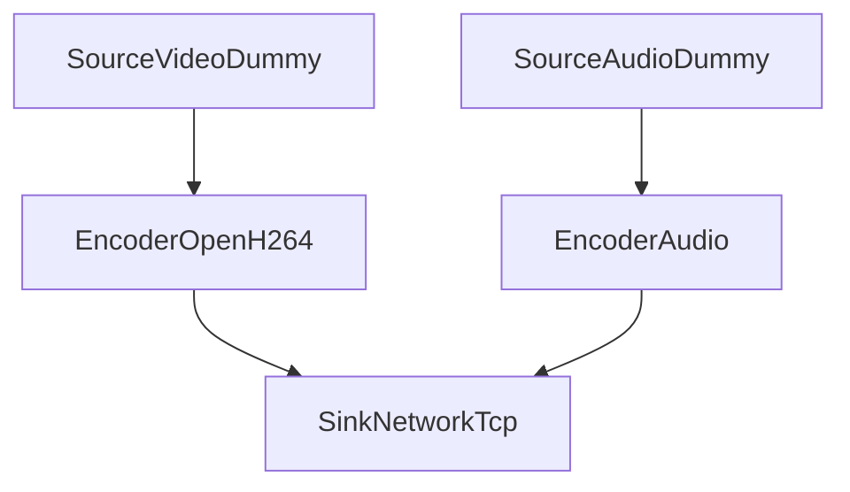
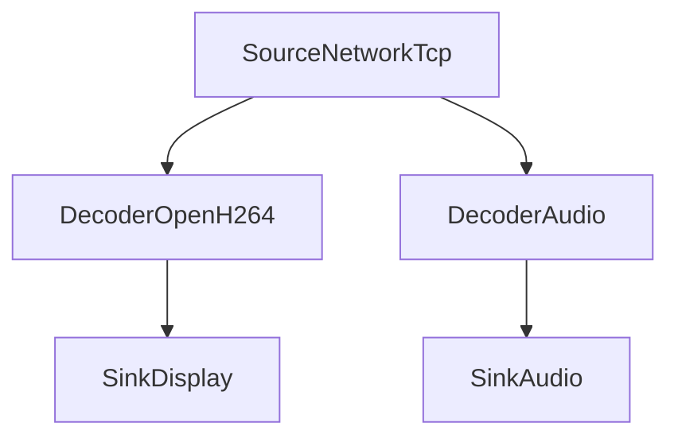
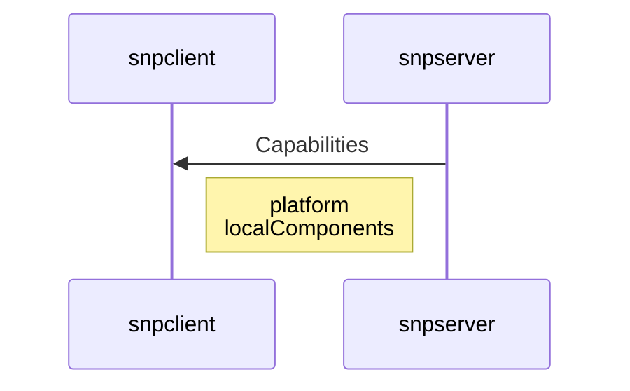
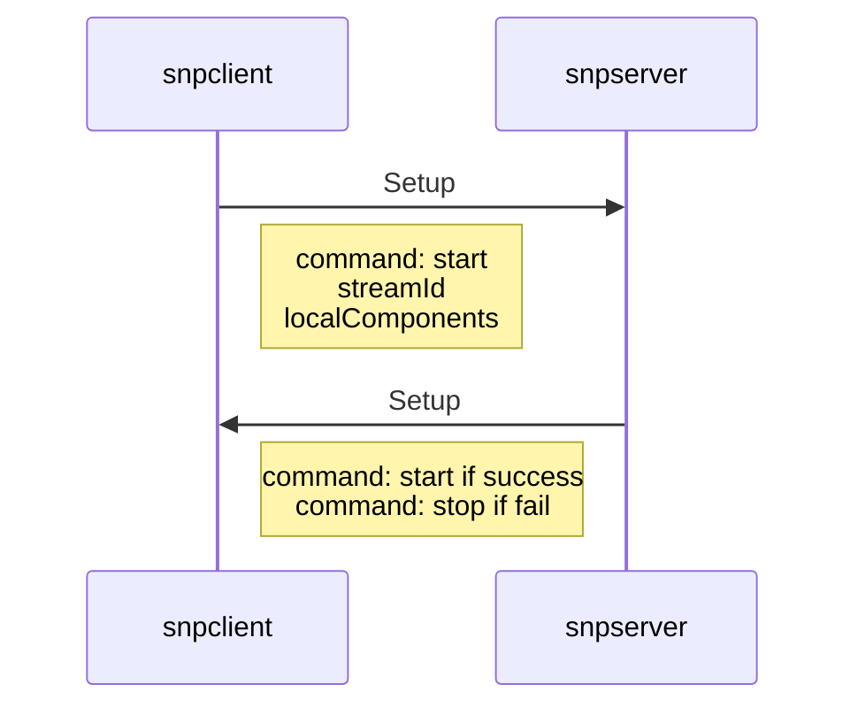
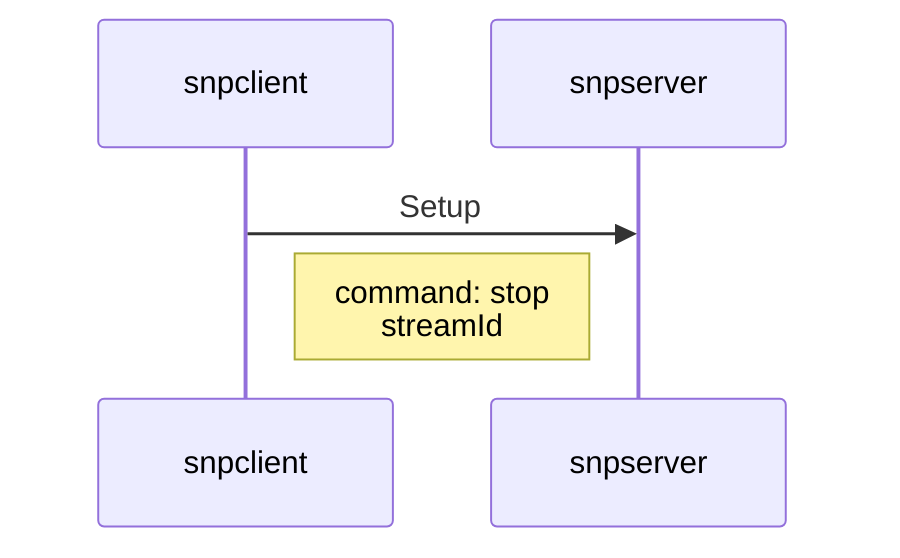
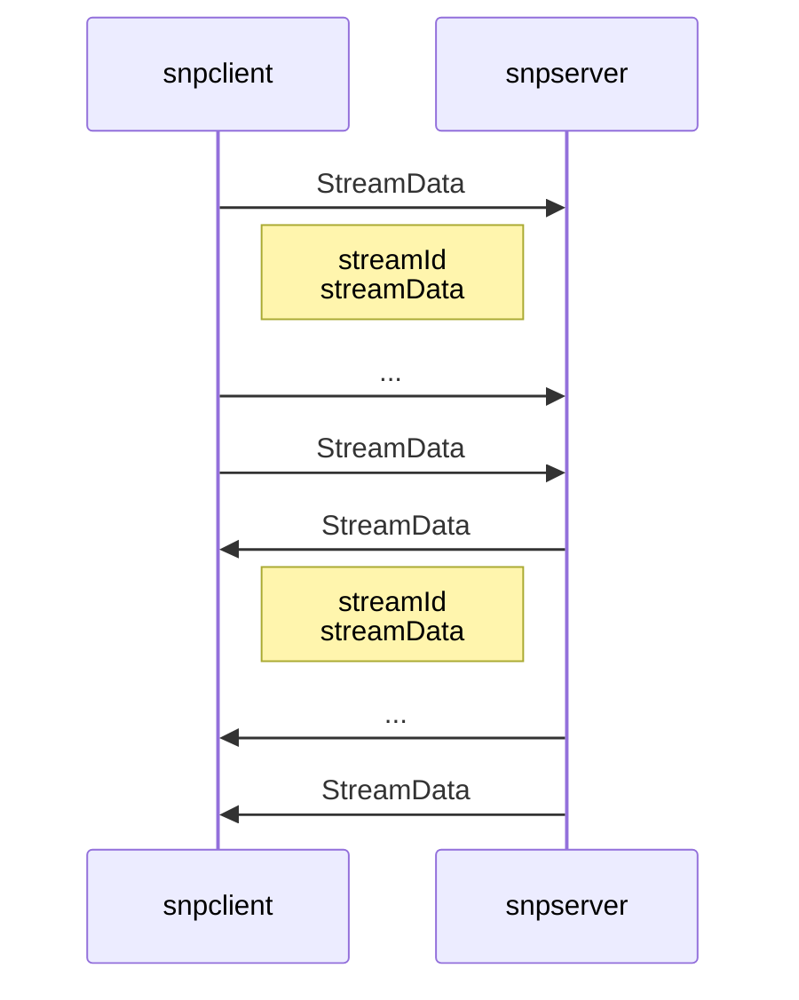
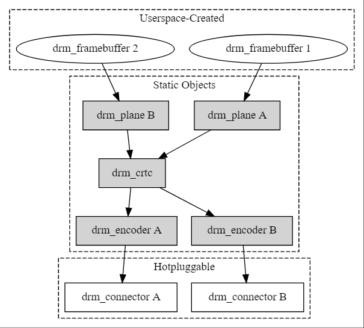
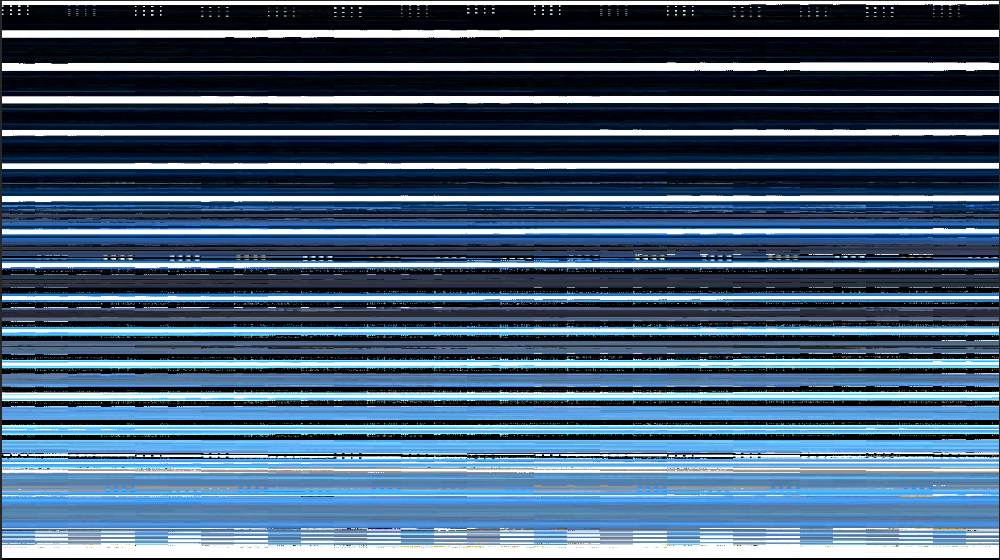

# SnpServer

SnpServer is modular multi-platform screen sharing server written in C++ with similar 
features like VNC. Major focus is put on screen capture performance using state of the 
art hardware accelerated compression algorithms built into modern cpu/gpu/socs. The 
also experimental client component (SnpClientWebsocket) is available at 
https://github.com/martin19/snpclient.

### Supported platforms

As of now the following localComponents are implemented:

* keyboard sharing
* mouse sharing
* cursor sharing  
* Raspberry Pi MMAL hardware encoder
* libva hardware encoder  
* openh264 software encoder 
* x11 grabber
* drm grabber

## Build instructions 

### Build on Ubuntu 22.04

#### Install dependencies

```shell
sudo apt install libwebsockets-dev
sudo apt install libva-dev
sudo apt install libdrm-dev
sudo apt install libxcomposite-dev

# download libopenh264 and copy to source folder
curl -L http://ciscobinary.openh264.org/libopenh264-2.1.1-linux64.6.so.bz2 | bzip2 -dk | sudo tee /usr/local/lib/libopenh264-2.1.1-linux64.so.6 > /dev/null
sudo chmod 755 /usr/local/lib/libopenh264-2.1.1-linux64.so.6

# download protobuf and copy to source folder
curl -o ./extern/protobuf-3.21.12/protobuf-cpp-3.21.12.tar.gz https://github.com/protocolbuffers/protobuf/releases/download/v21.12/protobuf-cpp-3.21.12.tar.gz
cd ./extern/protobuf-3.21.12
tar -xvzf protobuf-cpp-3.21.12.tar.gz
```

### Build on Windows 7/10/11
TODO: clean up dependencies and installation procedure
TODO: copy openh264 dll to executable path
TODO: reference snp.ini at correct location

#### Install dependencies
1. download qt 6.8 from `https://doc.qt.io/qt-6/windows.html` and install to `c:\qt`

2. protobuf libraries
```sh
# download protobuf 3.21.12 and extract to `extern/protobuf-3.21.12
curl -o ./extern/protobuf-3.21.12/protobuf-cpp-3.21.12.zip https://github.com/protocolbuffers/protobuf/releases/download/v21.12/protobuf-cpp-3.21.12.zip
cd extern/protobuf-3.21.12
unzip protobuf-cpp-3.21.12.zip
```

3. libva library environment variables
see https://www.nuget.org/packages/Microsoft.Direct3D.VideoAccelerationCompatibilityPack/

#### Common pitfalls

Check whether X11 or wayland is running:

```
ps aux | grep [w]ayland
ps aux | grep [X]
```

#### run

Enable X11 access for all local users:
```
export DISPLAY=:1.0
xhost +local: 
```

#### Generate protobuf headers

```
protoc --proto_path=proto --cpp_out=src/network proto/snappyv1.proto --experimental_allow_proto3_optional
```

## Background information

### Application architecture

#### Sample encoder chain (on server):


#### Sample decoder chain (on client):


### Protocol description

#### Services announcement


#### Start a stream


#### Stop a stream


#### Streaming data


### drm-gl screen capture method

The `SnpSourceGL` module implements a screen capture method which uses `libdrm` and `egl`.
There are some online resources for programming `libdrm` from
a user space perspective, however most documentation seems to go into very much detail
from a kernel perspective.

To understand the capture method, one needs to understand a little bit of `drm`, `egl`
and some `dma-buf`. I'll explain the interesting parts in the sections below.

### Accessing a framebuffer with DRM/KMS

DRM/KMS (direct rendering manager, kernel mode setting) is an abstraction for
hardware resources of different vendors which provides an api through `ioctl` calls.
As ioctl calls are quite cumbersome to use, a wrapper library called `libdrm` has been
created which should make programming a bit more convenient. With it directly
access of GPU resources from user space is possible. What are these resources?

* framebuffers
* planes
* crtcs
* encoders
* connectors

#### Connector
A connector represents an actual mostly physical connector on the GPU (such as the HDMI-1 port, 
or a Composite out if available..)
#### Encoder
Represents some signal transformation module to transform a signal from CRTC for  
one or multiple encoders.
#### CRTC
Literally a "Cathode ray tube controller" - but of course also supports tft and other displays.
It abstracts away display timings.
#### Plane
An image on the framebuffer can be made up of several planes. This abstraction is fairly
hard to grasp, and it is not really required to understand it in detail for our use case.
#### Framebuffer
A framebuffer is essentially a chunk of gpu memory which contains the pixel information
in a specific format (e.g, 1920x1080x32 - RGBA or some vendor specific pixel format) for example.
There is a *primary* framebuffer which contains the actual pixel information displayed
on the screen. There can be other framebuffers, e.g. a smaller one for the cursor is common.

The following illustration shows the relationship between these resource objects.



### Framebuffer Discovery
It turns out, to access a framebuffer it must be discovered first. Taking a look at the diagram
suggests the method to do this. Let's say we want to capture the contents of the display connected
to hdmi-1 port. To find the corresponding framebuffer we have to trace the path from the bottommost 
object (e.g. connector HDMI-1) to the (primary) framebuffer at the top. Then using the method 
`drmModeGetFB` a handle to the framebuffer object can be acquired.

### Framebuffer Memory Mapping
The framebuffer can be mapped directly to user-space memory which is useful to read back the
pixels without additionaly copy steps (_zero-copy_) or pass it directly to a compression algorithm, 
such as h.264 encoder. An area can be mapped to CPU adressable space by using a function called
`mmap`.

```
mmap(nullptr, width * height * bytesPerPixel, PROT_READ, MAP_SHARED, dmaBufFd, 0);
```

The following call returns a pointer to the actual framebuffer. According to the access mode
it can be directly read from and/or written to. The argument `dmaBufFd` is a file descriptor
referencing the actual framebuffer we want to access. 

### Framebuffer Internal Formats
On many gpus the framebuffer does not necessarily need to be in _linear_ format in gpu memory.
There are vendor specific _tiled_ representations that exist because the gpu can access/cache 
memory in a more efficient way. Interpreting and displaying an image available in tiled 
memory format as RGBA image produces an image related to the original image (because the number
of pixels in the image and the order of the individual color channels might be the same as for 
an linear RGBA format). Below is an example of a linux desktop in VC4 tiled format interpreted as
linear RGB.



As we can see, directly accessing and displaying a tiled representation in GPU memory 
poses a problem. But what can we do to access the framebuffer in linear format? 
The idea is to _either_ tell the application creating the framebuffer to create it in 
linear format _or_ to let the GPU essentially transform the image back into a linear read-out
format. 

#### Enforcing linear format
The application in charge for creating framebuffers is usually the windowing system
-- which is either X11 or Wayland on Linux. More specifically it is the component inside the 
windowing system responsible for talking to the GPU. If we find this component an tell it
to create the framebuffer in linear format instead of tiled format we are lucky. It turns out
for X11 said component is called `xf86-video-modesetting`. We can patch the software in such 
a way that framebuffers are actually created as linear ones 
(see [xf86-video-modesetting fork](https://github.com/martin19/xf86-video-modesetting/tree/tformat-workaround)
. This approach comes with a major drawback however: falling back to linear format has a 
performance impact on the performance of the desktop. Especially 3D applications seem to 
perform much worse than in tiled format. Another drawback from an application viewpoint
is the necessity of a patched driver.

#### Converting tiled to linear format 
Another way to access a framebuffer in linear format is to convert it back to linear format
for every captured frame. This sounds like an expensive operation to do in software as
every pixel has to be rearranged, however the GPU should be able to do this quickly as it
has the necessary "circuits built in". So how can we tell the gpu to do this conversion for us?

The idea is to do the following:

1. Create another framebuffer in linear format - the capture-framebuffer
2. For each frame, let the gpu copy the primary framebuffer in tiled format 
inside the capture-framebuffer
3. read out the capture-framebuffer   

It turns out `egl` provides the tools to do this conversion for us: there are extensions in
egl that enable interfacing with a drm framebuffer.

```
glEGLImageTargetTexture2DOES
```

The extension `glEGLImageTargetTexture2DOES` enables us to render *anything* to an GLImage
texture. We use this to  

We create _two_ images. The first image `imagePrimary` references our primary framebuffer.
We need to pass the appropriate parameters such as image format which is the tiled format
`DRM_FORMAT_MOD_BROADCOM_VC4_T_TILED` in this case, the file descriptor of the dmaBuf, width 
and height of the framebuffer. The second image `imageCapture` references our readout 
framebuffer. We have created this framebuffer beforehand with the appropriate functions in
libdrm (`drmModeAddFB2WithModifiers`) in linear read out format `DRM_FORMAT_XRGB8888`.

```
EGLAttrib const attribute_list_primary[] = {
    EGL_WIDTH, (int)fbPrimary->fbPtr->width,
    EGL_HEIGHT, (int)fbPrimary->fbPtr->height,
    EGL_LINUX_DRM_FOURCC_EXT, DRM_FORMAT_XRGB8888,
    EGL_DMA_BUF_PLANE0_FD_EXT, fbPrimary->dmaBufFd,
    EGL_DMA_BUF_PLANE0_OFFSET_EXT, 0,
    EGL_DMA_BUF_PLANE0_PITCH_EXT, (int)fbPrimary->fbPtr->pitch,
    EGL_DMA_BUF_PLANE0_MODIFIER_LO_EXT, DRM_FORMAT_MOD_BROADCOM_VC4_T_TILED & 0xFFFFFFFF,
    EGL_DMA_BUF_PLANE0_MODIFIER_HI_EXT, DRM_FORMAT_MOD_BROADCOM_VC4_T_TILED >> 32,
    EGL_DMA_BUF_PLANE0_MODIFIER_LO_EXT, I915_FORMAT_MOD_X_TILED & 0xFFFFFFFF,
    EGL_DMA_BUF_PLANE0_MODIFIER_HI_EXT, I915_FORMAT_MOD_X_TILED >> 32,
    EGL_NONE};
    
EGLAttrib const attribute_list_capture[] = {
    EGL_WIDTH, (int)fbCapture->fb2Ptr->width,
    EGL_HEIGHT, (int)fbCapture->fb2Ptr->height,
    EGL_LINUX_DRM_FOURCC_EXT, DRM_FORMAT_XRGB8888,
    EGL_DMA_BUF_PLANE0_FD_EXT, fbCapture->dmaBufFd,
    EGL_DMA_BUF_PLANE0_OFFSET_EXT, 0,
    EGL_DMA_BUF_PLANE0_PITCH_EXT, (int)fbCapture->fb2Ptr->pitches[0],
    EGL_DMA_BUF_PLANE0_MODIFIER_LO_EXT, DRM_FORMAT_MOD_LINEAR & 0xFFFFFFFF,
    EGL_DMA_BUF_PLANE0_MODIFIER_HI_EXT, DRM_FORMAT_MOD_LINEAR >> 32,
    EGL_NONE};    
    
imagePrimary = eglCreateImage(eglDisplay,
                              EGL_NO_CONTEXT,
                              EGL_LINUX_DMA_BUF_EXT,
                              (EGLClientBuffer)nullptr,
                              attribute_list_primary);

//create capture image - in linear mode
imageCapture = eglCreateImage(eglDisplay,
                              nullptr,
                              EGL_LINUX_DMA_BUF_EXT,
                              (EGLClientBuffer)nullptr,
                              attribute_list_capture);    
```

In the main capture loop we let egl read the input image into our _tiled input texture_
and write the output into our _linear capture texture_. We can then memory map the output 
image for direct read-out. 

```                              
glEGLImageTargetTexture2DOES(GL_TEXTURE_2D, imagePrimary);
glEGLImageTargetTexture2DOES(GL_TEXTURE_2D, imageCapture);                              
```


## License

Copyright (c) 2021 @martin19

Permission is hereby granted, free of charge, to any person obtaining
a copy of this software and associated documentation files (the
"Software"), to deal in the Software without restriction, including
without limitation the rights to use, copy, modify, merge, publish,
distribute, sublicense, and/or sell copies of the Software, and to
permit persons to whom the Software is furnished to do so, subject to
the following conditions:

The above copyright notice and this permission notice shall be
included in all copies or substantial portions of the Software.

THE SOFTWARE IS PROVIDED "AS IS", WITHOUT WARRANTY OF ANY KIND,
EXPRESS OR IMPLIED, INCLUDING BUT NOT LIMITED TO THE WARRANTIES OF
MERCHANTABILITY, FITNESS FOR A PARTICULAR PURPOSE AND
NONINFRINGEMENT. IN NO EVENT SHALL THE AUTHORS OR COPYRIGHT HOLDERS BE
LIABLE FOR ANY CLAIM, DAMAGES OR OTHER LIABILITY, WHETHER IN AN ACTION
OF CONTRACT, TORT OR OTHERWISE, ARISING FROM, OUT OF OR IN CONNECTION
WITH THE SOFTWARE OR THE USE OR OTHER DEALINGS IN THE SOFTWARE.
